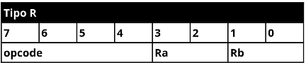
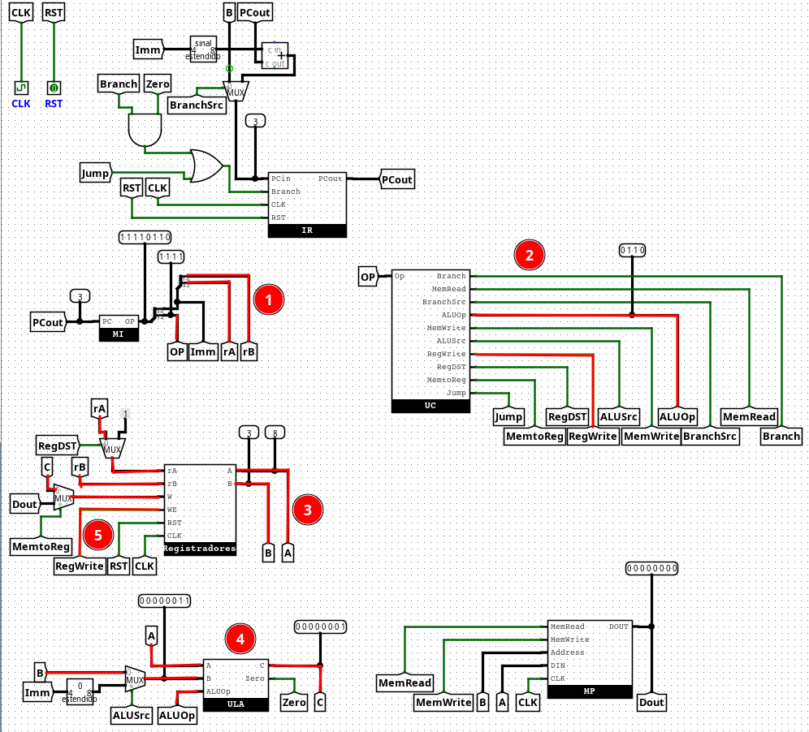

# Arquitetura Lobo-Guará

# Aluno
Wesley Ricardo Lamb

## Tipos de instruções

## Tabela de instruções

- R 0000 PC = R[rB] se R[rA] == 0
- I 0001 PC = Imm set R[rA] == 0
- R 0010 PC = R[rB]
- I 0011 PC = Imm
- R 0100 R[rA] = M[R[rB]]
- R 0101 M[R[rB]] = R[rA]
- R 0110 R[rA] = R[rB]
- I 0111 R[$1] = Imm + R[$1][3..0]
- I 1000 R[$1] = R[$1][7..4]
- R 1001 R[rA] = R[rA] + R[rB]
- R 1010 R[rA] = R[rA] - R[rB]
- R 1011 R[rA] = R[rA] & R[rB]
- R 1100 R[rA] = R[rA] | R[rB]
- R 1101 R[rA] = !R[rB]
- R 1110 R[rA] = R[rA] << R[rB]
- R 1111 R[rA] = R[rA] >> R[rB]

## Diagrama da UC

## Diagrama da ULA

## Caminhos de dados

### 0000

1. Intrução é carregada, tipo: R
2. OP Code é passado para a UC, UC aciona o sinal Branch e passa o ALUOp = 1010
3. É carregado os valores armazenados nos registradores rA e rB para A e B, respectivamente
4. A ULA recebe o valor de A, o ALUOp sinaliza que o valor de A deve ser encaminhado diretamente - para a saída. A ULA irá comparar a saída com o valor constante 0, se forem iguais, emitirá o sinal de Zero
5. O sinal de Branch emitido pela UC e o sinal de Zero pela ULA irão sinalizar se o novo valor de PC será ou não B.

### 0001

1. Intrução é carregada, tipo: I
2. OP Code é passado para a UC, UC aciona os sinais de RegDST, BranchSrc e Branch e passa o ALUOp = 1010
3. O RegDST sinaliza que devo carregar um registrador constante, então carrego o valor armazenado no registrador $1 em A
4. A ULA recebe o valor de A, o ALUOp sinaliza que o valor de A deve ser encaminhado diretamente - para a saída. A ULA irá comparar a saída com o valor constante 0, se forem iguais, emitirá o sinal de Zero
5. Soma-se o imediato que veio da instrução com o PC anterior. O BranchSrc irá passar o valor resultante para o registrador de instrução. O sinal de Branch emitido pela UC e o sinal de Zero pela ULA irão sinalizar se PC receberá ou não o novo valor

### 0010

1. Intrução é carregada, tipo: R
2. OP Code é passado para a UC, UC aciona o sinal Jump
3. Carrego o valor armazenado no registrador rB para B
4. O sinal de Jump emitido pela UC irá sinalizar que o novo valor de PC será B.

### 0011

1. Intrução é carregada, tipo: R
2. OP Code é passado para a UC, UC aciona o sinal Jump
3. Soma-se o valor de PC com o imediato
4. O sinal de Jump emitido pela UC irá sinalizar que o novo valor de PC será PC + imediato.

### 0100

1. Intrução é carregada, tipo: R
2. OP Code é passado para a UC, UC aciona os sinais MemRead, RegWrite e MemtoReg
3. Carrego o valor do rB para B
4. Leio o endereço de memória B
5. As alterações são salvas no registrador rA o valor que retornou da memória

### 0101

1. Intrução é carregada, tipo: R
2. OP Code é passado para a UC, UC aciona o sinal memWrite
3. Carrego o valor de rA e rB em A e B, respectivamente
4. As alterações são salvas na memória posição B o valor de A

### 0110

1. Intrução é carregada, tipo: R
2. OP Code é passado para a UC, UC aciona o sinal RegWrite e passa o ALUOp = 0111
3. Carrego os valores de rA e rB em A e B, respectivamente
4. Passo o B direto pela ULA
5. Salvo o valor de C no registrador rB

### 0111

1. Intrução é carregada, tipo: I
2. OP Code é passado para a UC, UC aciona os sinais ALUSrc, RegWrite, RegDST e passa o ALUOp = 1000
3. Carrego o valor de rA em A
4. Os 4 bits do Imm são convertidos em 8 bits, são shiftados 4 bits à esquerda e unificados aos 4 bits menos significativos do registrador $1
5. As alterações são salvas no registrador $1

### 1000

1. Intrução é carregada, tipo: I
2. OP Code é passado para a UC, UC aciona os sinais ALUSrc, RegWrite, RegDST e passa o ALUOp = 1000
3. Carrego o valor de rA em A
4. Os 4 bits do Imm são convertidos em 8 bits e unificados aos 4 bits mais significativos do registrador $1
5. As alterações são salvas no registrador $1

### 1001

1. Intrução é carregada, tipo: R
2. OP Code é passado para a UC, UC aciona o sinal RegWrite e passa o ALUOp = 0000
3. Carrego os valores de rA e rB em A e B, respectivamente
4. Os valores de A e B são somados na ULA, resultando em C
5. C é salvo no registrador rA

### 1010

1. Intrução é carregada, tipo: R
2. OP Code é passado para a UC, UC aciona o sinal RegWrite e passa o ALUOp = 0000
3. Carrego os valores de rA e rB em A e B, respectivamente
4. Os valores de A e B são subtraídos na ULA, resultando em C
5. C é salvo no registrador rA

### 1011

1. Intrução é carregada, tipo: R
2. OP Code é passado para a UC, UC aciona o sinal RegWrite e passa o ALUOp = 0000
3. Carrego os valores de rA e rB em A e B, respectivamente
4. Os valores de A e B são comparados na ULA, resultando em C
5. C é salvo no registrador rA

### 1100

1. Intrução é carregada, tipo: R
2. OP Code é passado para a UC, UC aciona o sinal RegWrite e passa o ALUOp = 0000
3. Carrego os valores de rA e rB em A e B, respectivamente
4. Os valores de A e B são comparados na ULA, resultando em C
5. C é salvo no registrador rA

### 1101

1. Intrução é carregada, tipo: R
2. OP Code é passado para a UC, UC aciona o sinal RegWrite e passa o ALUOp = 0000
3. Carrego os valores de rA e rB em A e B, respectivamente
4. O valor de B é negado resultando em C
5. C é salvo no registrador rA

### 1110

1. Intrução é carregada, tipo: R
2. OP Code é passado para a UC, UC aciona o sinal RegWrite e passa o ALUOp = 0000
3. Carrego os valores de rA e rB em A e B, respectivamente
4. O valor de A é shiftado para esquerda B vezes, resultando em C
5. C é salvo no registrador rA

### 1111

1. Intrução é carregada, tipo: R
2. OP Code é passado para a UC, UC aciona o sinal RegWrite e passa o ALUOp = 0000
3. Carrego os valores de rA e rB em A e B, respectivamente
4. O valor de A é shiftado para direta B vezes, resultando em C
5. C é salvo no registrador rA

